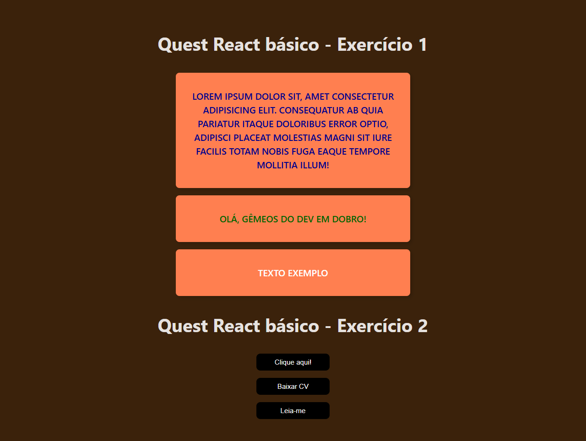

<div align='center'>
    <h1>Quest React básico</h1>
    <p>Projeto desafio do curso DevQuest, referente ao React módulo básico.</p>
    
    
    
    
    
    <p style="margin:1.5rem 0">⚠️ Projeto finalizado ⚠️</p>
</div>

<h2 style="font-size:2.5rem;">Tabela de conteúdos</h2>

<!--ts-->
   * [Sobre o projeto](#sobre-o-projeto)
   * [Funcionalidades](#funcionalidades)
   * [Layout](#layout)
   * [Como executar o projeto](#como-executar-o-projeto)
     * [Pré-requisitos](#pré-requisitos)
     * [Instalação do projeto](#instalação-do-projeto)
     * [Executando o projeto](#executando-o-projeto)
   * [Tecnologias](#tecnologias)
   * [Autor](#autor)
   * [Licença](#user-content--licença)
<!--te-->

## Sobre o projeto

O projeto consiste na resolução de dois exercícios propostos pelo curso [DevQuest](https://www.linkedin.com/school/devquest-dev-em-dobro/?originalSubdomain=br), referentes ao módulo básico do React.

## Funcionalidades

<ul>
    <li>Os usuários, ao acessarem o projeto, podem:
        <ul>
            <li>Visualizar o resultado de ambos os exercícios;</li>
            <li>Clicar sobre os botões;</li>
            <li>Visualizar a mensagem exibida após clicar sobre cada botão.</li>
        </ul>
    </li>
</ul>

## Layout

Abaixo segue uma imagem do projeto, versão desktop:



## Como executar o projeto

### Pré-requisitos

Antes de começar, você vai precisar ter instalado em sua máquina as seguintes ferramentas:
[Git](https://git-scm.com), [Node.js](https://nodejs.org/en/). 

Além disso é bom ter um editor para trabalhar com o código, como [VSCode](https://code.visualstudio.com/).

### Instalação do projeto

Passos para instalar e rodar o projeto localmente:

1 - Clone o repositório

```bash
git clone https://github.com/Hugo-Moreira91/quest-react-basico.git
cd quest-react-basico
```

2 - Instale as dependências

```bash
npm install
```

### Executando o projeto

```bash
npm run dev
```

## Tecnologias

As seguintes ferramentas foram utilizadas na construção do projeto:

- [Node.js](https://nodejs.org/en/)
- [React(Vite)](https://vite.dev/guide/)

Veja o arquivo [package.json](https://github.com/Hugo-Moreira91/quest-react-basico/blob/main/package.json) para mais detalhes.

- Utilitários
    - Editor: [Visual Studio Code](https://code.visualstudio.com/)

## Autor

<a href="https://github.com/Hugo-Moreira91">
    
    <br/ >
    <p>Hugo Moreira 🚀</p>
</a>
<p>Feito com ❤️</p>
<p>Entre em contato! 👇🏼</p>

[](https://www.linkedin.com/in/hugo-c%C3%A9sar-santos-moreira-a10823248/)
[](mailto:hugo.cesar91@gmail.com)